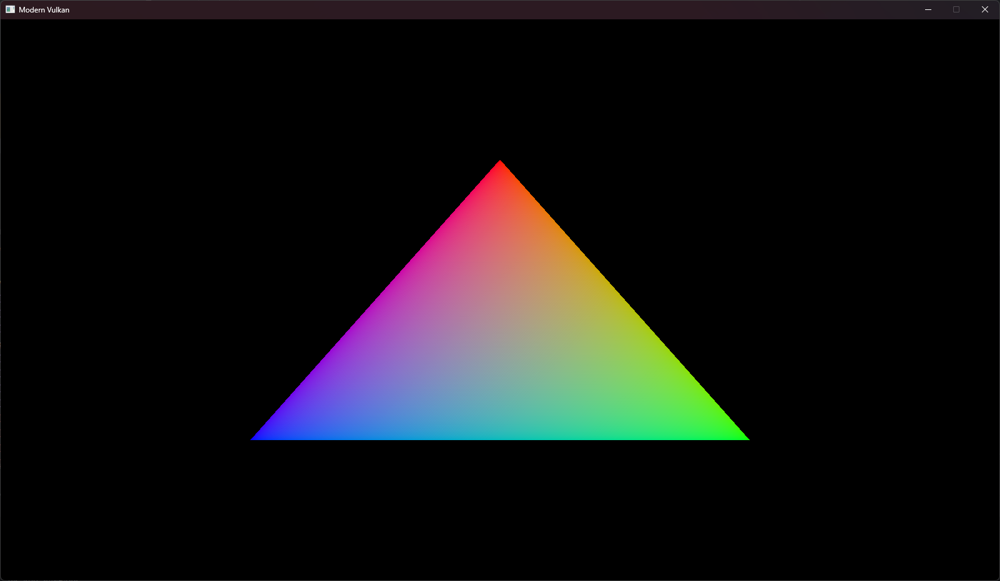

# Modern Vulkan Tutorial

A vulkan repository with embedded Slang Compilation for Vulkan 1.4 and Vulkan HPP.

## Some Screenshots

## Features Implemented

- Vulkan 1.4
- Slang Embedded Compilation
- Vulkan-Hpp with RAII
- Dynamic Rendering

## Sources

See the [Khronos Vulkan Tutorial](https://docs.vulkan.org/tutorial/latest/00_Introduction.html) for more information.